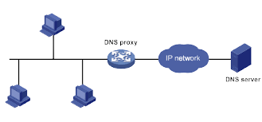

# NSProxy
Nowadays, due to the huge increase in websites and people’s use of them, from a point-of-view of a network engineer, a Huge number of domains need to be resolved by DNS servers.  
As an interesting fact, a typical home connected to the internet makes ~10k  DNS queries per day!  
DNS proxy forwards DNS requests and replies between DNS clients and DNS servers.  

## Installation
### Run using docker (recommended)
- (Optional) Create config file `config.json` with the appropriate config values
- Run a container using the following command (Change options as desired)  
` docker run -d -p 1053:53/udp --name=mynsproxy -v ./config.json:/etc/nsproxy.json mahdilotfi/nsproxy:latest`

### Docker compose (persistent cache)
- (Optional) Edit file `config.json` with the appropriate values
- Run required containers using `docker compose up -f docker-compose.yml up -d`

### Install from source
- Run `sudo make install` to build and install the project
- Run `sudo systemctl start nsproxy` to start the server
#### Uninstallation
- Run `sudo make uninstall` to stop and remove installed files

## Configuration
You can override the following configurations in the `/etc/nsproxy.json` file.

| Key                   | Description                                                                       | Default Value              |
|-----------------------|-----------------------------------------------------------------------------------|----------------------------|
| cache-expiration-time | The duration for which cache entries will remain active                           | TTL of the RRs             |
| cache-url             | The URL of the cache utilized for caching resource records (RRs)                  | "" (means in memory cache) |
| external-dns-servers  | A list of external servers utilized to resolve unresolved DNS requests            | ["8.8.8.8:53"]             |
| external-dns-timeout  | The expiration time for an external DNS request before attempting the next server | 0 (means no timeout)       |

## Upcoming

- [ ] Additional info from cache
- [ ] Generic wildcard matching

## Additional Info & References

- **RFC 1034** DOMAIN NAMES - CONCEPTS AND FACILITIES
- **RFC 1035** DOMAIN NAMES - IMPLEMENTATION AND SPECIFICATION
- **RFC 3596** DNS Extensions to Support IP Version 6
